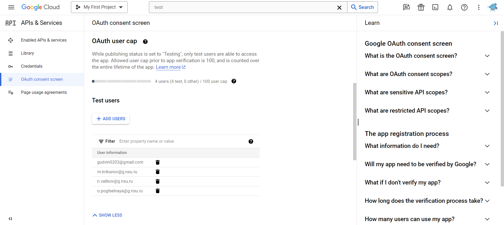
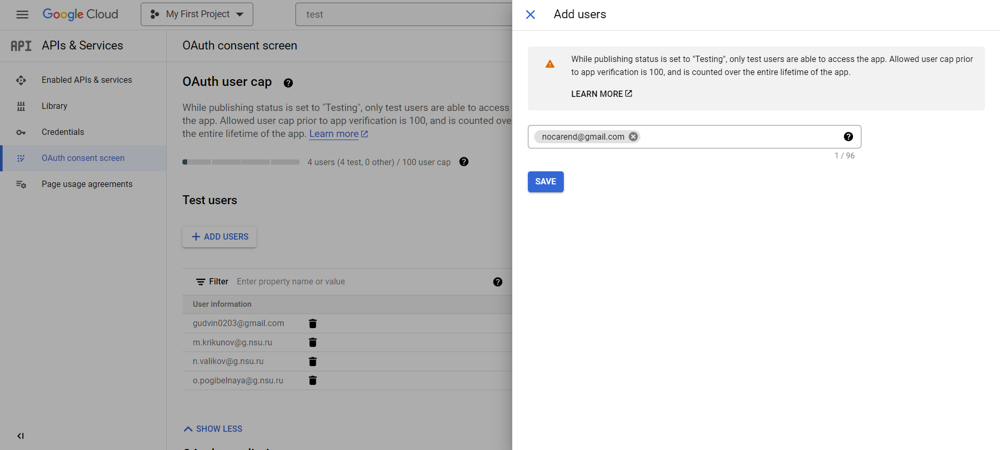
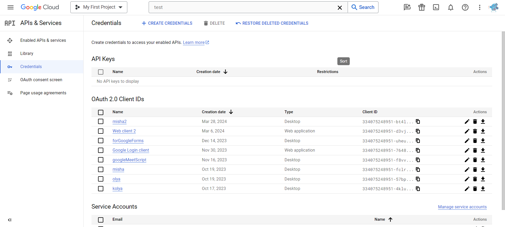
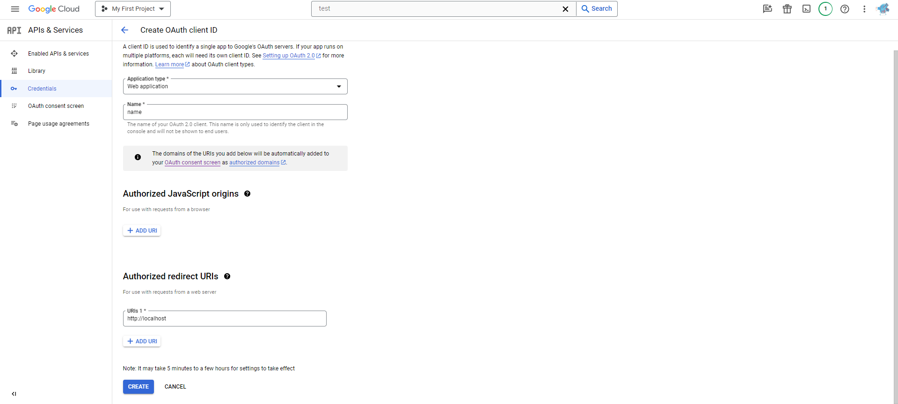

# EnrollEase setup

## Setup environment

- You need to replace `ADMIN_EMAIL` variable from `docker-compose.yml` with your email. Email must
  be added into [Google Cloud Console](https://console.cloud.google.com/).
- Any new user must be added as Test User into Google Cloud Console. [Instruction](#how-to-add-test-user)
- You need to replace `INDIVIDUAL_ACHIEVEMENTS_FOLDER_ID`, `PORTFOLIO_FOLDER_ID`, `COMMON_FOLDER_ID`, `PORTFOLIO_FORM_SHEET_ID`, `PORTFOLIO_FORM_SHEET_LIST_NAME`, `PORTFOLIO_DOC_TEMPLATE_ID` 
  from `scripts/googler/Google.py` with your values.
  - `INDIVIDUAL_ACHIEVEMENTS_FOLDER_ID` - folder which stores users participating in second wave competition.
  - `PORTFOLIO_FOLDER_ID` - folder which stores users participating in first wave competition.
  - `COMMON_FOLDER_ID` - common folder containing `INDIVIDUAL_ACHIEVEMENTS_FOLDER_ID` и `PORTFOLIO_FOLDER_ID`. For use in backup script.
  - `PORTFOLIO_FORM_SHEET_ID` - sheet containing responses from apply form.
  - `PORTFOLIO_FORM_SHEET_LIST_NAME` - specific table from previous sheet.
  - `PORTFOLIO_DOC_TEMPLATE_ID` - template for default form generation.
- You need to replace `scripts/googler/credentials.json` with yours obtained from Google Cloud Console. [Instruction](#how-to-create-credentials)
- You need to generate tokens for accessing API. It could be done by running `__main__` from `scripts/googler/Google.py`.

### How to add test user
1. Go to `https://console.cloud.google.com/apis/credentials/consent?project=<PROJECT_NAME>`

2. Click `+ ADD USERS`

3. Type an email and click `SAVE`

### How to create credentials
1. Go to `https://console.cloud.google.com/apis/credentials?project=<PROJECT_NAME>`

2. Click `Create credentials` -> `OAuth client ID`.
3. Choose `Web application` as `Application type`.
4. Type some name and add `http://localhost` to `Authorized redirect URIs` field.
5. Click `CREATE`.

6. Download this JSON, put into `scripts/googler`, rename to `credentials.json`.

## Spring profiles

In `boot.sh` you can choose one of available profiles:
- `prod` - setting up services with admin profile
- `test_data` - the same as `prod` but with pre-created data

## Deploy

We need the jar file of the application. It could be done with `gradle build`.  
After put with `Dockerfile`, `docker-compose.yml`, `boot.sh` in the same directory.  
Then we can start docker containers with `docker-compose up --build`.

